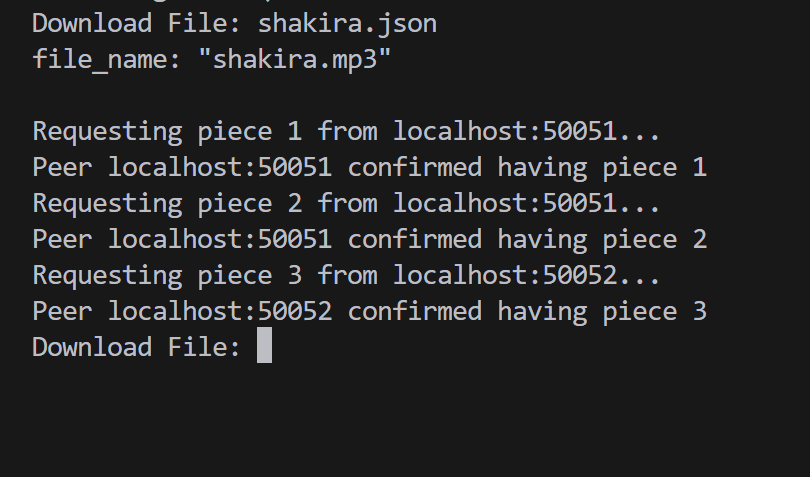

# ST0263 - Tópicos Especiales en Telemática

### Estudiantes
- Maria Camila Morales Rios, mcmoralesr@eafit.edu.co
- Nicolas Jose Sanchez Mendoza, njsanchezm@eafit.edu.co

### Profesor
- Juan Carlos Montoya Mendoza - jcmontoy@eafit.edu.co

# Aplicaciones P2P: BitTorrent

## 1. Descripción

### Aspectos logrados

- Se realizó la comunicación entre peers para que compartan información por medio del protocolo gRPC.
- Se implementó el tracker que asocia a cada peer con alguna parte de un archivo y distribuye a los peers cliente entre todos los peers servidor que tienen la pieza que se está buscando por medio del metodo de round-robin.
- Se creó un cliente que descarga un archivo .json (reemplazando el .torrent) desde un servidor web, y procede a comunicarse con el tracker para localizar la ubicación de las piezas que forman el archivo original
- Se creó un webserver por el cual los clientes pueden descargar un archivo .json que contiene el metadata del torrent
- Se logró que los peers informen al tracker de su entrada y salida de la red y que el tracker pueda actualizar su información de los peers correctamente
- Se usó multithreading para permitir que el proceso de servidor de los peers y del tracker puedan manejar multiples clientes en concurrente

### Aspectos no logrados

- No se logró implementar la partición automática de un archivo, al no haber transmisión real de archivos decidimos que las piezas que almacena cada peer ya están predefinidas
- Al estar predefinidas las piezas de cada peer, no hay un sistema de replicación, el tracker es capaz de dirigir a los clientes a los todos peers que almacenen una misma pieza pero no hay un algoritmo que decida realizar la replicación.
- No se implementó el proceso servidor de los peers como microservicios separados, todas las funciones operan bajo el mismo proceso
- No se desplegó el proyecto en AWS, el sistema opera en la maquina local haciendo uso de distintos puertos>

## 2. Información de diseño

Entre los peers hay un diseño P2P, en el que cualquier peer cliente se puede comunicar con cualquier otro peer servidor, al hacer uso de un tracker, el diseño es centralizado, aunque la transeferencia del archivo se haga en una arquitectura P2P, la comunicacion con el tracker es de tipo Client/Server, donde el tracker guarda información que los clientes le solicitan unicamente a él.

La comunicación con el Web Server sigue la arquitectura Cliente/Servidor


## 3. Descripción del ambiente de desarrollo

### Compilación

1. (Opcional) Cree y active un ambiente virtual de Python en el que se instalarán las dependencias
    ```bash
    conda create -n tet-reto1
    conda activate tet-reto1
    ```
    ```bash
    python -m venv venv_name
    source venv_name/bin/activate
    ```

1. Ejecute uno de los archivos `setup` según lo requiera su sistema operativo, `.bat` for Windows or `.sh` for Linux or Mac
    ```bash
    sh ./setup.sh
    ```
    Este archivo realizará la instalación de dependencias y también compilará la estructura de mensajes usada basada en el archivo `tracker.proto`

1. Ejecute el archivo de python para el proceso que necesite: `./peer/client.py` `./peer/server.py` `./tracker/tracker.py` `./webserver/webserver.py`
    ```bash
    python ./peer/server.py
    ```

### Detalles del desarrollo

Como lenguaje de programación se usó `Python 3.12.5`

### Detalles técnicos

Las librerias usadas para el proyecto están en el archivo `./requirements.txt`, estas fueron generadas usando `pip freeze > requirements.txt` por lo que incluye librerias base de python, librerias estandar de un ambiente de MiniConda3 y dependencias de librerias instaladas.

Las librerias manualmente instaladas con `pip` fueron
```python
Flask==3.0.3  # Para el webserver 
grpcio==1.66.1  # Para la comunicacion gRPC
grpcio-tools==1.66.1
protobuf==5.28.1  # Para la compilacion del tracker.proto  
requests==2.32.3  # Para la comunicacion con el webserver
```
Para instalar las librerias manualmente: (Las librerias tambien se instalan con el archivo `setup.bat` o `setup.sh`)
```
pip install -r ./requirements.txt
```

### Configuración del proyecto

En caso de que el tracker no esté en la misma maquina que los peer se debe cambiar la variable global `TRACKER_ADDRESS` en los archivos `/peer/client.py` y `/peer/server.py` con la direccion de su tracker

Para el tracker `/tracker/tracker.py` se usa una variable global `PORT` que por defecto usa el puerto 50050 así que no es necesario de cambiarse, en caso de cambiarse tambien se debe cambiar la variable global `TRACKER_ADDRESS` los archivos `/peer/client.py` y `/peer/server.py`

Para los peer `/peer/server.py` tambien se usa una variable `PORT` esta define el puerto inicial de los peer, a medida que se añadan mas peers en una misma maquina se incrementa la variable `PEER_NUMBER`, si los peer están en distintas maquinas no es necesario

Para el peer `/peer/client.py` se usa la variable `TRACKER_ADDRESS` que se actualiza con la dirección del tracker y la variable `WEB_SERVER_ADDRESS` que se actualiza con la dirección del webserver

### Organización del proyecto
```
PROJECT-ROOT-DIR
│   requirements.txt
│   setup.bat
│   setup.sh
│   tracker.proto
├───peer
│   │   client.py
│   │   server.py
│   ├───res
│   │   |   peer-1.json
│   │   |   peer-2.json
├───tracker
│   │   tracker.py
└───webserver
    │   webserver.py
    └───res
        |   shakira.json
```

### Resultados

Al ejecutar el cliente:


## 4. Información relevante

### Setup

**Archivos .torrent:** Los archivos de torrent que descarga el cliente están ubicados en `./webserver/res/` en formato `.json`, el proyecto cuenta con un archivo de ejemplo `shakira.json` y siguen esta estructura
```json
{
  "file_name": "file.txt", // Nombre del archivo (Metadata) 
  "total_pieces": 2, // Numero de piezas en las que se divide el arhcivo
  "pieces": [
    {
      "number": 1, // Indice de la pieza
      "hash": "abcd1234" // Hash asociado con la pieza
    },
    {
      "number": 2,
      "hash": "efgh5678"
    }
  ]
}
```
Cada pieza definida debe también configurarse en `./peer/res/peer-n.json` donde `n` es el numero del peer definido en `./peer/server.py :: PEER_NUMBER`, el json tiene la estructura
```json
{
  "file_info": [
    {
      "file_name": "file.txt", // Nombre del arhcivo
      "total": 1, // Total de piezas que almacena
      "pieces": [
        {
          "number": 1, // Indice de la pieza
          "hash": "abcd1234" // Hash asociado
        }
      ]
    }
  ]
}
```
Para que un cliente pueda localizar un archivo completo los peers deben almacenar todas las piezas entre ellos, puede ser que un peer tenga las primeras 2 piezas y otro tenga la tercera o cualquier otra combinación

### Ejecución

Ejecute todos los archivos de python listados en el paso 3 de Compilacion asegurando que el tracker se ejecute siempre antes que los peers.

```
python ./tracker/tracker.py
```

Una vez todo se esté ejecutando, en el cliente le va a pedir una entrada
```
Download File:
```
Aqui se pone el nombre del archivo en `./webserver/res/` que se va a descargar del web server
```
Download File: shakira.json
```

## Referencias

<!-- <debemos siempre reconocer los créditos de partes del código que reutilizaremos, así como referencias a youtube, o referencias bibliográficas utilizadas para desarrollar el proyecto o la actividad>
## sitio1-url 
## sitio2-url
## url de donde tomo info para desarrollar este proyecto -->